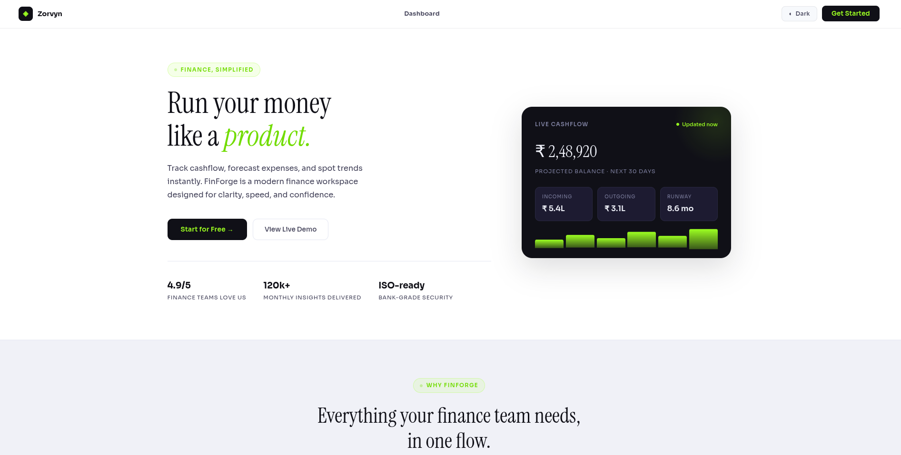
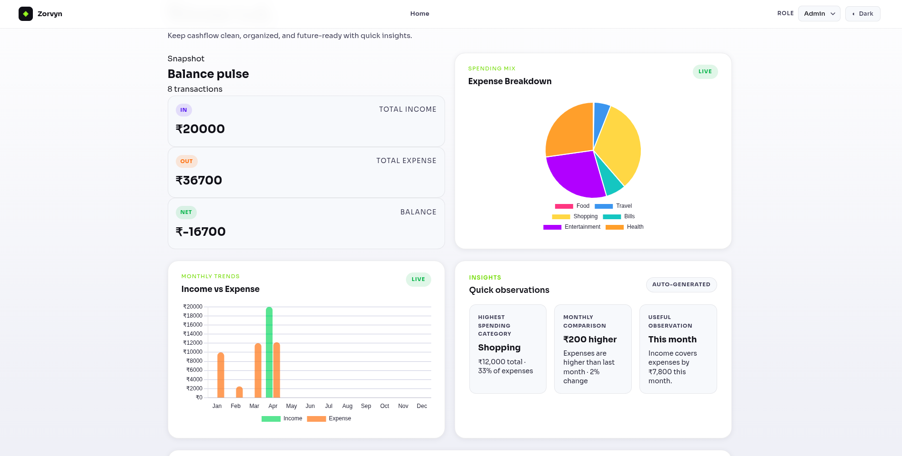
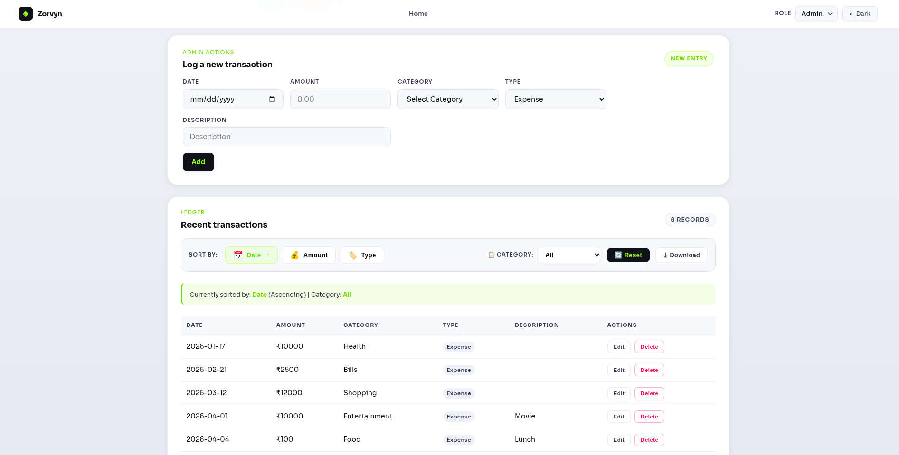

# Finance Dashboard

A responsive personal finance dashboard built with **React and Vite**.
The application allows users to manage transactions, visualize spending patterns, and export financial data. It simulates **viewer/admin roles**, provides **interactive charts**, and generates **basic insights** from transaction history.

The project is designed as a **frontend-focused demo application** showcasing UI design, state management, chart visualization, and data handling using modern React practices.

---

# Live Demo

https://finance-dashboard-seven-wine.vercel.app

---

# Features

### Dashboard Overview

* Summary cards showing **Total Income, Total Expense, and Balance**
* Clean UI with responsive layout
* Automatic updates when transactions change

### Transaction Management

* Add new transactions (Admin mode)
* Edit existing transactions
* Delete transactions
* Categorize income and expenses

### Transaction Table

* Sort by **date, amount, or transaction type**
* Filter transactions by **category**
* Responsive table layout
* Empty-state handling for better UX

### Charts & Visualization

* **Monthly income vs expense** comparison chart
* **Expense distribution by category**
* Built with Chart.js for interactive visualization

### Insights System

Automatically generates useful insights including:

* Highest spending category
* Monthly income vs expense comparison
* Observational insight based on spending patterns

### Data Export

Export the currently filtered/sorted transactions as:

* **CSV**
* **JSON**

### Role Simulation

The application simulates two user roles:

**Viewer**

* Read-only access
* Can view dashboard, charts, and insights

**Admin**

* Can add, edit, and delete transactions
* Full access to transaction management

### UI Features

* Responsive layout
* Light/Dark mode toggle
* Smooth modal interactions
* Clean dashboard-style layout

---

# Tech Stack

Frontend

* **React**
* **Vite**

Visualization

* **Chart.js**
* **react-chartjs-2**

State & Storage

* React Hooks
* localStorage (for demo persistence)

Styling

* Custom CSS

---

### Routing & Performance

The application uses **React Router** for client-side navigation.

To improve performance, pages are **lazy loaded using React.lazy and Suspense**.
This ensures that large components like the dashboard are only loaded when needed, reducing the initial bundle size and improving page load performance.

A fallback loading UI is displayed while components are being loaded.

Routes implemented:

* `/` — Home page
* `/dashboard` — Main finance dashboard
* `*` — Custom **Not Found (404)** page for invalid routes

---

# Project Structure

```
frontend/
  src/
    components/
      chart/
        MonthlyChart.jsx
        MonthlyChart.css
        SpendingChart.jsx
        SpendingChart.css
      insights/
        InsightsSection.jsx
        InsightsSection.jsx
      layout/
        Header.jsx
        Header.css
      summary/
        SummaryCard.jsx
        SummaryCard.css
        SummarySection.jsx
        SummarySection.css
      transaction/
        TransactionForm.jsx
        TransactionForm.css
        TransactionTable.jsx
        TransactionTable.css    
    pages/
      Dashboard.jsx
      HomePage.jsx
      NotFound.jsx
    styles/
      App.css
      Dashboard.css
      HomePage.css
      NotFound.css
    App.jsx
    main.jsx
```

---

# Getting Started

## 1. Clone the Repository

```bash
git clone https://github.com/RashelAkhtar/Finance-Dashboard.git
cd Finance-Dashboard
```

## 2. Install Dependencies

```bash
cd frontend
npm install
```

## 3. Start the Development Server

```bash
npm run dev
```

Open the URL shown in the terminal (usually):

```
http://localhost:5173
```

---

# Available Scripts

From the `frontend` directory:

### Start Development Server

```bash
npm run dev
```

### Build for Production

```bash
npm run build
```

Production files will be generated inside:

```
dist/
```

### Preview Production Build

```bash
npm run preview
```

---

# Usage Guide

### Selecting a Role

When the application starts you can choose between:

* **Viewer Mode**
* **Admin Mode**

Admin mode unlocks transaction management features.

---

### Adding Transactions

Admin users can add transactions by providing:

* Date
* Amount
* Category
* Type (Income / Expense)
* Description

---

### Sorting and Filtering

Transactions can be:

* Sorted by **date, amount, or type**
* Filtered by **category**

The table updates instantly based on selected options.

---

### Exporting Data

Click the **Download button** in the transaction table to export the current view as:

* CSV file
* JSON file

The export respects the **current sorting and filtering**.

---

# Data Storage

For demonstration purposes, transaction data is stored in:

```
localStorage
```

---

# Screenshots





---

